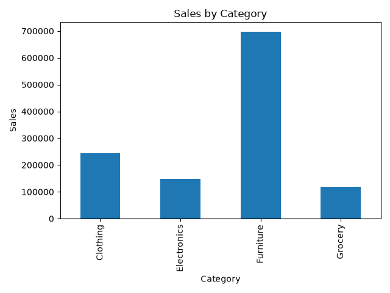
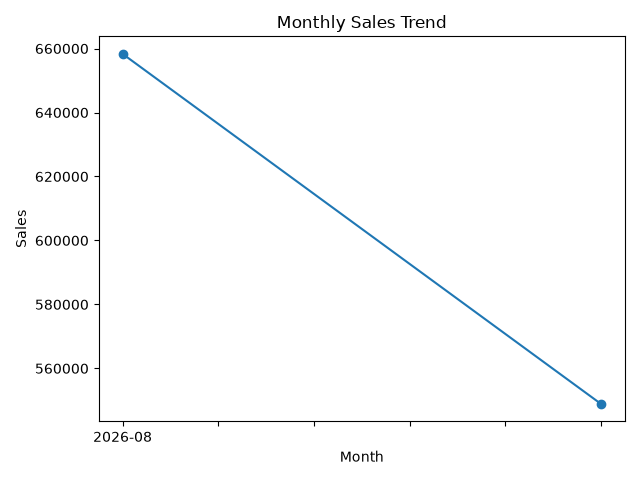

# Thiranex Task 4 – Data Cleaning & Reporting Automation

##  Project Overview

This project was completed as part of the Thiranex Data Analytics Internship – Task 4.

The objective of this task was to clean a messy sales dataset, handle missing and inconsistent data, remove duplicates, automate reporting, and generate visual summaries using Python.

##  Technologies Used

- Python
- Pandas
- NumPy
- Matplotlib
- Excel
- OpenPyXL

##  Dataset

The original dataset contained 185 sales records with intentionally introduced data-quality issues such as:

- Missing values
- Duplicate records
- Inconsistent text formatting
- Invalid dates
- Invalid quantity and price values
- Inconsistent category names
- Incorrect or missing sales values

##  Data Cleaning Process

The following steps were performed:

1. Loaded the Excel dataset using Pandas.
2. Standardized column names.
3. Cleaned text values and formatting.
4. Converted dates into proper date format.
5. Converted numeric columns into numeric data types.
6. Fixed invalid quantity and unit price values.
7. Filled missing text values.
8. Removed duplicate rows.
9. Recalculated the Sales column using Quantity × Unit Price.
10. Standardized inconsistent category names.
11. Validated the cleaned dataset.

##  Data Quality Results

| Metric | Before Cleaning | After Cleaning |
|---|---:|---:|
| Rows | 185 | 182 |
| Duplicate Rows | 3 | 0 |
| Missing Values | Present | 0 |
| Invalid Values | Present | Fixed |
| Category Inconsistency | Present | Standardized |

##  Visualizations

### Sales by Category

The project generates a bar chart showing total sales for each category.



### Monthly Sales Trend

The project also generates a line chart showing the monthly sales trend.



##  Generated Reports

### Cleaned Sales Data
`cleaned_sales_data.xlsx`

Contains the cleaned and validated sales dataset.

### Automated Report
`automated_report.xlsx`

Contains:
- Cleaned Data
- Sales Summary

##  Project Files

```text
Thiranex-Task-4-Data-Cleaning-Automation/
│
├── Thiranex_Task4_Messy_Sales_Data.xlsx
├── cleaned_sales_data.xlsx
├── automated_report.xlsx
├── data_cleaning_automation.py
├── sales_by_category.png
├── monthly_sales_trend.png
└── README.md
